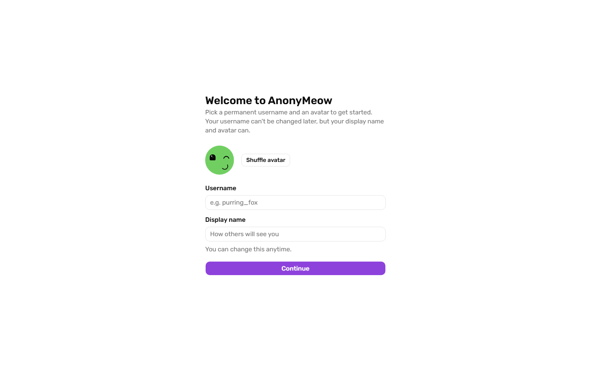
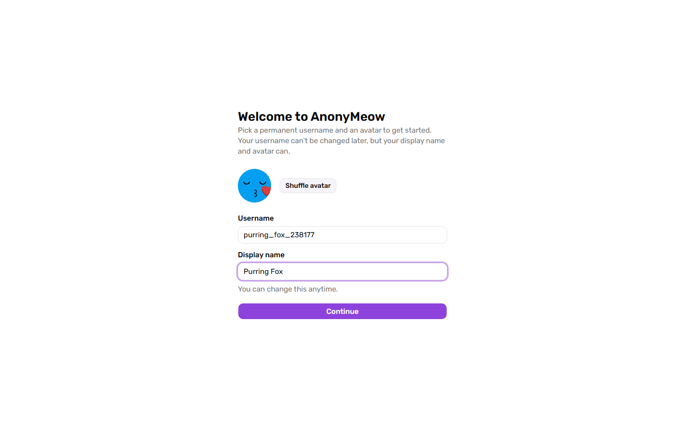
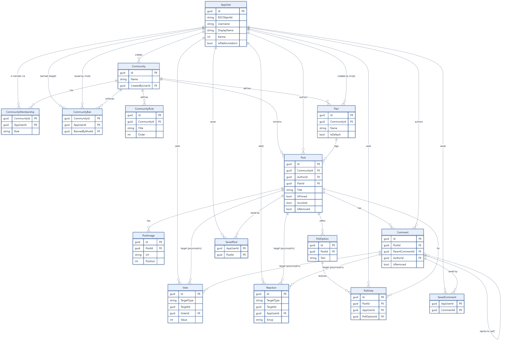

<div align="center">

# AnonyMeow

**An anonymous, Reddit-style forum with a pseudonym-first identity model.**


</div>

Users sign up with an email — used only for authentication and account recovery, never shown to
anyone — and are represented everywhere else by a permanent, unique **username**, a changeable
**display name**, and a DiceBear avatar. Content lives in topic **communities** with threaded
comments, voting, reactions, and polls; on top of that sits a pseudonym-based friend graph, private
messaging, and moderation tooling that notifies users of enforcement rather than shadow-banning
them silently.

See [docs/FEATURES.md](docs/FEATURES.md) for the full feature spec and the reasoning behind the
identity model.

## Screenshots

<table>
<tr>
<td></td>
<td></td>
</tr>
<tr>
<td align="center"><em>Onboarding</em></td>
<td align="center"><em>Permanent username, changeable display name & avatar</em></td>
</tr>
</table>

More screens (communities, posts, polls, messaging, notifications) are in
[docs/portfolio-media/screenshots/](docs/portfolio-media/screenshots/), and a full click-through
walkthrough is at [docs/portfolio-media/video/](docs/portfolio-media/video/).

## Architecture

A full-stack monolith — one ASP.NET Core process, no microservices:

| Layer | Technology |
|---|---|
| Backend | ASP.NET Core Minimal API (C#, .NET 10) |
| Frontend | React 19 + TypeScript + Vite |
| Database | PostgreSQL (EF Core / Npgsql) |
| Real-time | SignalR (notifications, messaging) |
| Auth | OpenID Connect / Microsoft Entra External ID (CIAM), JWT bearer |
| Storage | Azure Blob Storage (post images, via short-lived SAS URLs) |
| Cloud | Microsoft Azure (App Service, Static Web Apps) |


The backend follows a layered `Endpoints → Services → Data` structure behind a Minimal API,
with cross-cutting concerns (auth, validation, rate limiting, exception handling) in middleware
rather than duplicated per endpoint:


### More diagrams

16 diagrams cover the full system — domain model (ERDs), the auth pipeline and every native-auth
flow (sign-up, sign-in, password reset), content safety (PII + spam detection), feed ranking,
messaging, and moderation. Full index with narrative write-ups: **[docs/diagrams/](docs/diagrams/README.md)**.

<table>
<tr>
<td></td>
<td></td>
</tr>
<tr>
<td align="center"><em>Domain model — core content (ERD)</em></td>
<td align="center"><em>Content safety pipeline (Composite pattern)</em></td>
</tr>
</table>

## Design & engineering conventions

SOLID throughout, applied deliberately rather than by rote: Strategy for feed ranking (keyed DI
per sort mode), Composite for PII/spam detection pipelines, policy-based authorization for
role/ownership checks, and DTOs at every API boundary — no EF Core entity is ever serialized
directly. See [docs/backend/architecture.md](docs/backend/architecture.md) for the full rundown,
and [CLAUDE.md](CLAUDE.md) for the development/testing conventions this codebase holds itself to.

## Documentation

- **[docs/README.md](docs/README.md)** — project layout and getting-started details
- **[docs/backend/](docs/backend/README.md)** — architecture, domain model, auth, API surface, key flows, cross-cutting concerns, testing
- **[docs/diagrams/](docs/diagrams/README.md)** — the full diagram set
- **[docs/FEATURES.md](docs/FEATURES.md)** — feature spec and identity-model rationale
- **[docs/deployment-guide.md](docs/deployment-guide.md)** / **[docs/azure-ciam-setup.md](docs/azure-ciam-setup.md)** — Azure deployment and CIAM tenant setup

## Getting started

### Backend

Requirements: [.NET 10 SDK](https://dotnet.microsoft.com/download), PostgreSQL (or Docker, for
integration tests which use Testcontainers).

```bash
cd backend
dotnet build "AnonyMeow.sln"
dotnet test "AnonyMeow.sln"
dotnet run --project "AnonyMeow.csproj" --launch-profile https
```

Configure secrets (connection strings, CIAM settings, blob storage) via `dotnet user-secrets`
locally — see `appsettings.json` for the expected configuration shape. Never commit real secrets.
In Development, `/api/dev/token` mints self-signed JWTs so the CIAM dependency can be bypassed
entirely for local work.

### Frontend

Requirements: Node.js.

```bash
cd frontend
npm install
npm run dev       # start the Vite dev server
npm run test      # unit tests (Vitest)
npm run lint      # lint (Oxlint)
```

## Testing

275+ xUnit unit tests (services, validators, authorization handlers) plus an integration suite
built on `WebApplicationFactory` against a real, Testcontainers-provisioned PostgreSQL instance —
no in-memory/fake database provider, so behavior matches production. See
[docs/backend/testing.md](docs/backend/testing.md) for conventions.

## Project layout

```
backend/     ASP.NET Core Minimal API solution (API project + xUnit unit/integration tests)
frontend/    React + TypeScript + Vite single-page app
infra/       Bicep templates for Azure resource provisioning
docs/        Documentation, diagrams, and portfolio media
```
