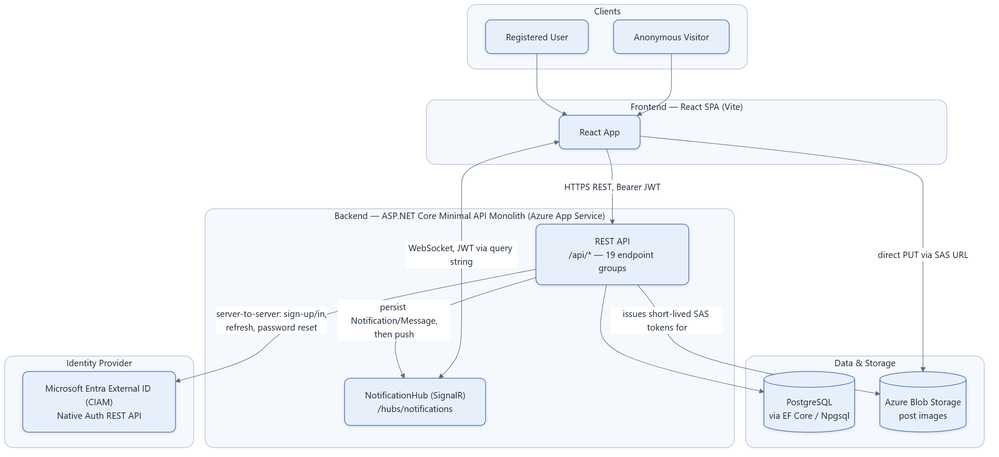

# System / Container Architecture

Everything the backend talks to, and how. AnonyMeow's backend is a single ASP.NET Core Minimal
API process (monolith) — there is no separate microservice for auth, notifications, etc. The
"services" in the diagram below are external systems and Azure resources, not internal DI
services (those are covered in [03](03-backend-layered-architecture-and-pipeline.md)).

## Notes

- **No cookies, no CORS credentials**: auth is bearer-JWT only, so CORS (`FrontendDev` policy,
  `backend/Program.cs`) doesn't need `AllowCredentials` — origin is restricted to a single
  configured frontend origin (`Cors:FrontendOrigin`, default `http://localhost:5173`).
- **Images never pass through the API body**: Kestrel's `MaxRequestBodySize` is capped at 1MB
  (all request bodies are JSON text). Clients call `POST /api/uploads/images/sas` to get a
  short-lived SAS URL, then `PUT` bytes to Blob Storage directly.
- **CIAM is called server-side only**, never from the browser — the native-auth REST API doesn't
  support CORS, so `NativeAuthEndpoints` acts as a thin authenticated proxy (see
  [07](07-auth-signup-flow.md)–[09](09-auth-password-reset-and-refresh-flow.md)).
- **SignalR reuses the same JWT bearer scheme**: since browsers can't set an `Authorization`
  header on a WebSocket handshake, `Program.cs`'s `OnMessageReceived` event promotes an
  `?access_token=` query parameter to a bearer token, but only for requests under `/hubs`.
- **In Development**, `DevAuthEndpoints` (`/api/dev/token`) mints self-signed JWTs so the CIAM
  dependency can be bypassed entirely for local dev/testing.
