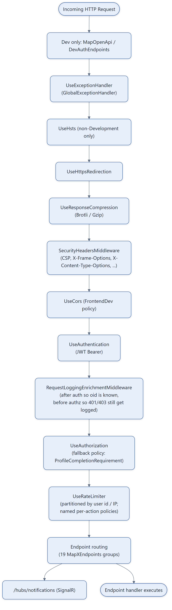
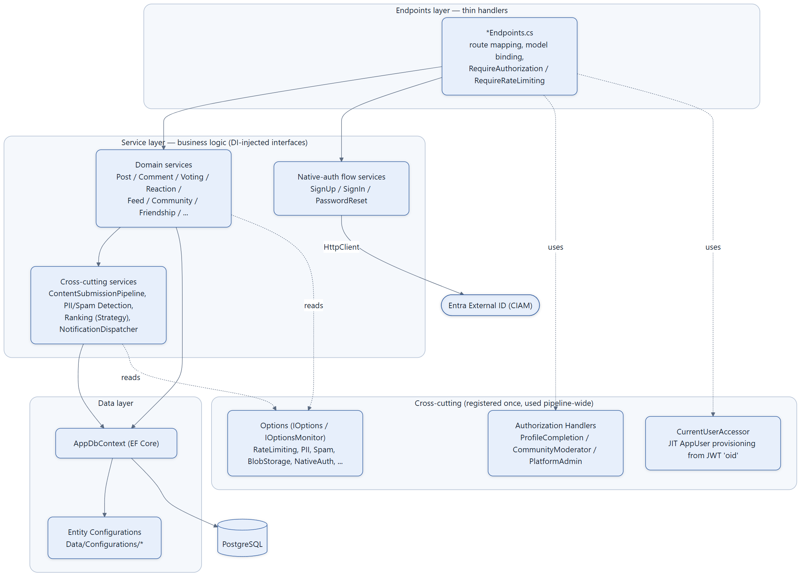

# Layered Architecture & Middleware Pipeline

Two views of the same monolith: the request pipeline every HTTP call passes through
(`backend/Program.cs`, top-to-bottom `app.Use*` order), and the logical layering of
Endpoints → Services → Data with cross-cutting concerns plugged in via DI.

## Middleware pipeline (exact order from `Program.cs`)

## Layering: Endpoints → Services → Data

## Notes

- **Fallback authorization policy is opt-out, not opt-in**: `AddAuthorizationBuilder().SetFallbackPolicy(...)`
  applies `RequireAuthenticatedUser() + ProfileCompletionRequirement` to *every* endpoint unless it
  explicitly calls `.AllowAnonymous()` or a different named policy. This is why so many endpoints
  in the route tables ([06](06-authorization-and-authentication-pipeline.md)) have no visible auth
  annotation — the default is "authenticated + profile complete."
  - **DI service groupings** (all in `Program.cs`): core/infra, auth/current-user, domain
  services (posts/comments/voting/ranking, incl. 6 keyed `ISortStrategy` registrations), 
  notifications/moderation, community/social, admin/discovery/search, PII detection (Composite),
  spam detection (Composite), options (`Configure<T>`), native-auth `HttpClient`, authN/authZ,
  rate limiting, SignalR, CORS.
- **Rate limiting** is a `PartitionedRateLimiter` keyed by user id (if authenticated) or remote IP,
  with named per-action `FixedWindowLimiter` policies (`CreatePost`, `CreateComment`,
  `SendMessage`, `Vote`, `Report`, `ImageUpload`, `SignUpStart`, `SignUpVerify`, `SignInStart`,
  `PasswordReset`, `RefreshToken`) applied via `.RequireRateLimiting("...")` on specific routes.
  Rejections return `429` and are logged.
- **`CurrentUserAccessor`** auto-creates an `AppUser` row keyed by the JWT's `oid` claim on first
  authenticated request (just-in-time provisioning) — so authorization checks always have a user
  row to evaluate against, even before `complete-profile` has been called.
