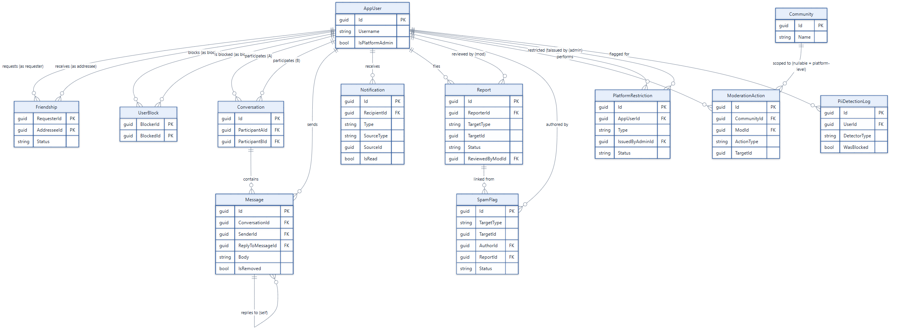

# Domain Model — Social, Messaging & Trust/Safety (ER Diagram, part 2 of 2)

Entities for friendships, blocking, direct messaging, notifications, reports, moderation actions,
spam flags, platform restrictions, and PII detection logs. `AppUser` and `Community` are repeated
here as anchors — see
[04-domain-model-core-content.md](04-domain-model-core-content.md) for their full field list and
for `Post`/`Comment` (which `Report`/`SpamFlag` also polymorphically target).

## Notes

- **`Report.TargetType`/`TargetId` and `SpamFlag.TargetType`/`TargetId` are polymorphic across
  three types**: `Post`, `Comment` (both in [04](04-domain-model-core-content.md)), and `Message`
  (in this diagram) — omitted as direct edges to avoid a confusing cross-diagram reference, but
  functionally identical to the `Vote`/`Reaction` polymorphism pattern in part 1.
- **`SpamFlag` always has a companion `Report`**: automated spam detection
  ([12](12-content-safety-pipeline.md)) files a `Report` (`Category = Spam`) on behalf of a
  synthetic system `AppUser`, then writes one `SpamFlag` row per matched heuristic reason linked
  to that `Report` — spam flows through the *same* moderator review queue as user-filed reports
  rather than a parallel one.
- **`ModerationAction.CommunityId` is the platform/community discriminator**: `null` means a
  platform-level action (via `PlatformAdmin` policy), a set value means a community-scoped action
  (via `CommunityModerator` policy) — see [17](17-moderation-and-admin-flow.md).
- **`Conversation` and `Friendship`/`UserBlock` model directional pairs without a junction table**:
  `Conversation` canonicalizes `(ParticipantAId, ParticipantBId)` by GUID comparison (lower GUID
  = A) so a lookup finds the same row regardless of who initiates.
- Full source: `backend/Domain/*.cs`, `backend/Domain/Enums/*.cs`.
