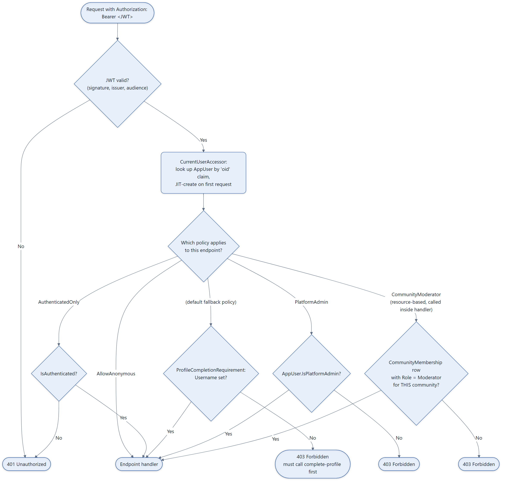

# Authorization Pipeline

How a request goes from "has a JWT" to "is allowed to hit this handler." This sits inside the
`UseAuthentication` → `UseAuthorization` stage of
[03-backend-layered-architecture-and-pipeline.md](03-backend-layered-architecture-and-pipeline.md).
Actual token issuance is covered by the native-auth flows in
[07](07-auth-signup-flow.md)–[09](09-auth-password-reset-and-refresh-flow.md).

## Notes

- **The fallback policy is the default for almost every route.** `Program.cs` calls
  `AddAuthorizationBuilder().SetFallbackPolicy(RequireAuthenticatedUser + ProfileCompletionRequirement)`
  — an endpoint is locked behind "authenticated AND profile complete" unless it explicitly opts
  out with `.AllowAnonymous()` or requests a different named policy.
- **`AuthenticatedOnly`** exists specifically for the two endpoints that must work *before* a
  username exists: `POST /api/auth/complete-profile` and `GET /api/users/check-username`.
- **`CommunityModerator` is resource-based, not route-based.** Because it needs the concrete
  `Community` the action targets, it's never declared as `.RequireAuthorization("CommunityModerator")`
  on a route — instead, handlers call
  `authorizationService.AuthorizeAsync(user, community, "CommunityModerator")` explicitly after
  loading the resource. `CommunityModeratorHandler` checks for a `CommunityMembership` row with
  `Role == Moderator` for that specific community + user.
- **`PlatformAdmin`** is route-based (`RequireAuthorization("PlatformAdmin")` on the whole
  `AdminEndpoints` group) and just checks `AppUser.IsPlatformAdmin`.
- Source: `backend/Common/Authorization/*.cs` (3 handler/requirement pairs), `backend/Program.cs`
  (policy registration), `backend/Services/CurrentUserAccessor.cs` (JIT provisioning).
