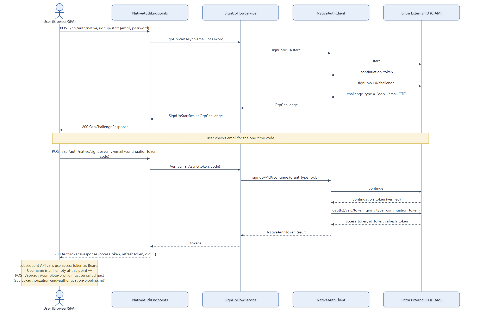

# Auth Flow — Sign-Up

Native auth sign-up against Microsoft Entra External ID (CIAM). The backend never talks to CIAM
from the browser — `NativeAuthEndpoints` proxies every step server-side because the CIAM native
auth REST API doesn't support CORS.

## Notes

- **Full path (typical, OTP-required tenant config)**: start → oob challenge → verify-email
  (submits code) → token exchange → tokens issued.
- **`user_already_exists` on start** triggers a best-effort fallback: `SignUpFlowService` tries
  `SignInFlowService.StartAsync` with the same credentials (handles the case where a prior sign-up
  completed OTP but token exchange failed previously). If that also fails, it surfaces
  `NativeAuthEmailAlreadyRegisteredException`.
- **A `redirect` challenge type** (unsupported flow) throws `NativeAuthUnavailableException`.
- **If the tenant is configured without email verification**, the challenge type is `password`
  instead of `oob` — `SignUpFlowService.ContinueWithPasswordThenExchangeAsync` submits the
  password directly and exchanges for tokens immediately, skipping the OTP step entirely. Not
  shown above since the deployed tenant uses OTP.
- **Weak passwords** are mapped by `NativeAuthErrorMapping` (shared with password reset) into a
  user-facing message rather than a raw CIAM error code.
- Source: `backend/Services/NativeAuth/SignUpFlowService.cs`, `NativeAuthClient.cs`,
  `backend/Endpoints/NativeAuthEndpoints.cs`.
