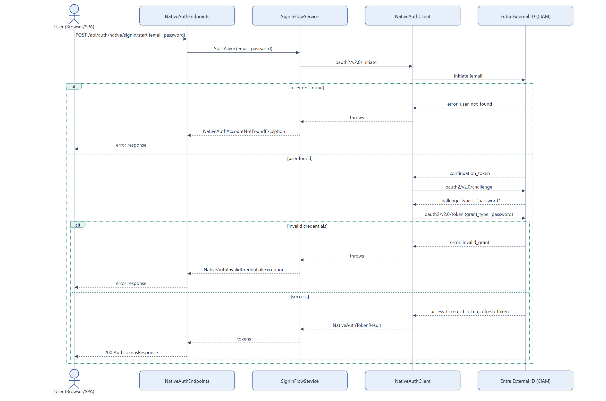

# Auth Flow — Sign-In

Native auth sign-in against Microsoft Entra External ID (CIAM). The tenant is configured for
"email with password" only — there is no OTP/MFA step on sign-in (unlike sign-up and password
reset, which both use an email OTP).

## Notes

- **No OTP step for sign-in.** If the tenant ever returns a challenge type other than `password`,
  `SignInFlowService` treats it as unsupported and throws `NativeAuthUnavailableException` — the
  code path only implements the password challenge.
- **`oid` extraction**: the endpoint decodes the `id_token`'s `oid` claim (trusted — it came over
  server-to-server HTTPS from CIAM, not re-validated) and returns it pre-extracted in
  `AuthTokensResponse` alongside the raw tokens.
- **Token validation on subsequent requests** is separate from this flow — the backend's own JWT
  bearer middleware validates `access_token` against the CIAM Authority/Audience on every
  authenticated API call (or against `DevJwtTokenFactory`'s signing key in Development). See
  [06-authorization-and-authentication-pipeline.md](06-authorization-and-authentication-pipeline.md).
- Source: `backend/Services/NativeAuth/SignInFlowService.cs`, `NativeAuthClient.cs`.
