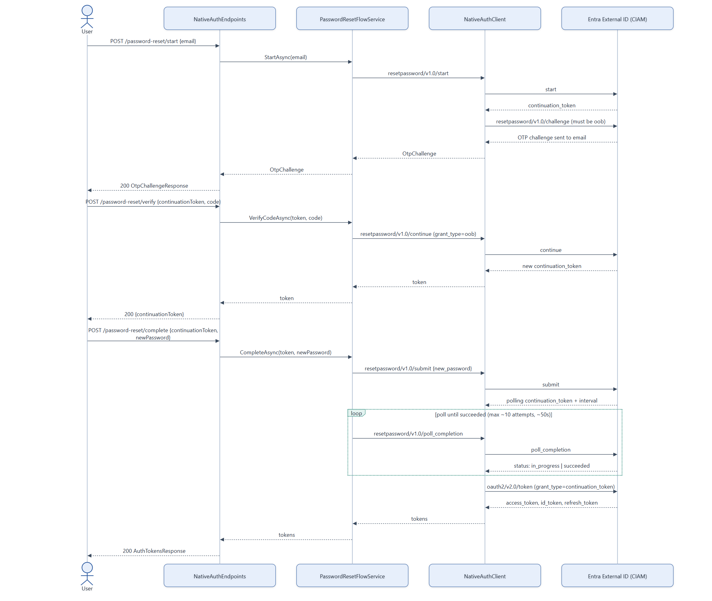
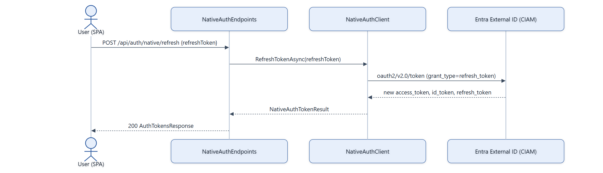

# Auth Flow — Password Reset & Token Refresh

Password reset is the most involved native-auth flow: it has an OTP step like sign-up, plus an
asynchronous polling step on Microsoft's side before the new password takes effect. Token refresh
is a single round trip.

## Password reset

## Token refresh

## Notes

- **`user_not_found` on reset start** → `NativeAuthAccountNotFoundException`, same as sign-in.
- **The submit → poll → exchange sequence exists because password changes are asynchronous on
  Microsoft's side** — `submit` returns immediately with a polling token, and
  `PollUntilCompleteAsync` clamps the poll interval to 1–5 seconds and caps at 10 attempts
  (~50 seconds total) before giving up.
- **Weak-password errors** on `complete` reuse `NativeAuthErrorMapping.IsWeakPasswordSubError` /
  `DescribeWeakPassword`, the same mapping used in the sign-up flow.
- **Refresh has no dedicated flow service** — `NativeAuthEndpoints` calls `INativeAuthClient`
  directly since it's a single unconditional round trip with no branching.
- **Unmapped tenant errors anywhere in these flows** are logged and surfaced as a generic
  `NativeAuthUnavailableException` (503) rather than leaking raw CIAM error details to the client.
- Source: `backend/Services/NativeAuth/PasswordResetFlowService.cs`, `NativeAuthClient.cs`,
  `NativeAuthErrorMapping.cs`.
