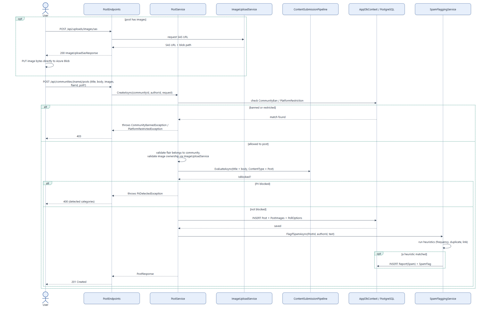

# Feature Flow — Post Creation

End-to-end path for creating a post, including the optional direct-to-Blob image upload and the
content-safety gate. The PII/spam mechanics themselves are detailed in
[12-content-safety-pipeline.md](12-content-safety-pipeline.md) — this diagram shows where they
plug into the post-creation flow.

## Notes

- **Rate limited**: `POST /api/communities/{name}/posts` uses the `CreatePost` rate-limit policy;
  the SAS endpoint uses `ImageUpload`.
- **Ban/restriction check happens before anything else** — `CommunityBan` is scoped to this one
  community, `PlatformRestriction` blocks posting everywhere (see
  [17-moderation-and-admin-flow.md](17-moderation-and-admin-flow.md) for the distinction).
- **PII is a hard gate, spam is not**: a PII match with `WasBlocked=true` prevents the post from
  ever being persisted; a spam-heuristic match happens *after* the post is already saved and only
  files a report — the post stays published pending moderator review.
- **Polls**: if the request includes poll options, they're persisted alongside the post in the
  same save; voting on them is a separate flow (`POST /api/posts/{id}/poll-votes`, not diagrammed
  separately — single-select upsert, same shape as saving/unsaving).
- Source: `backend/Services/PostService.cs`, `backend/Services/ContentSubmission/ContentSubmissionPipeline.cs`,
  `backend/Services/ImageUploadService.cs`, `backend/Endpoints/PostEndpoints.cs`.
