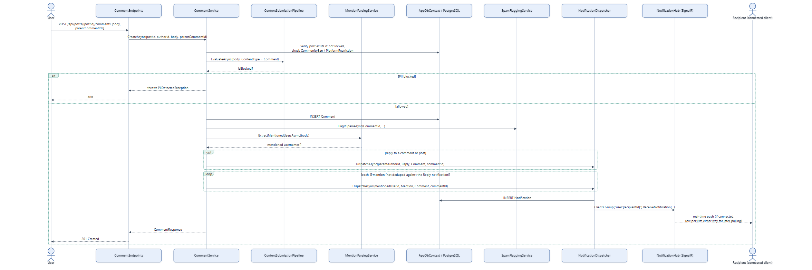

# Feature Flow — Comment Creation & Notification Fan-Out

Creating a comment or reply, including mention parsing and the real-time notification push. This
is the primary path that exercises `NotificationDispatcher` end to end (persist + SignalR push) —
see also [15-messaging-flow.md](15-messaging-flow.md) for the separate (non-`Notification`-table)
push path used by direct messages.

## Notes

- **Self-replies don't notify** — `CommentService` skips dispatch when the parent comment's (or
  post's) author is the commenter themselves.
- **Reply and Mention notifications are independent** — replying to someone who is also mentioned
  in the body produces two separate `Notification` rows, not a merged one.
- **`NotificationDispatcher` is the single seam that touches SignalR** — every other trigger listed
  below goes through the same `DispatchAsync` method, so the push mechanism only needs to be
  understood once:

  | Trigger | Caller | Type |
  |---|---|---|
  | Reply to a comment/post | `CommentService.CreateAsync` | Reply |
  | @mention in a comment | `CommentService.CreateAsync` via `MentionParsingService` | Mention |
  | Friend request sent | `FriendshipService.RequestAsync` | FriendRequest |
  | Post/comment removed, ban/unban, mod promote/demote, platform restrict/lift | `ModerationActionService.*` | ModAction |

- **If the recipient isn't connected to the hub**, the `Notification` row still exists and is
  retrievable via `GET /api/notifications` — the SignalR push is a convenience, not the source of
  truth.
- Source: `backend/Services/CommentService.cs`, `backend/Services/NotificationDispatcher.cs`,
  `backend/Services/MentionParsingService.cs`, `backend/Hubs/NotificationHub.cs`.
