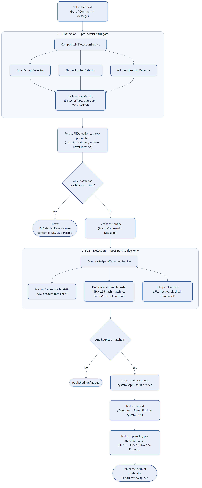

# Cross-Cutting Mechanism — Content Safety Pipeline (PII + Spam)

Every piece of user-submitted text (post, comment, or direct message) passes through two
independently-pluggable Composite-pattern pipelines before and after it's persisted. This diagram
isolates the mechanism itself; see it wired into feature flows in
[10-post-creation-flow.md](10-post-creation-flow.md),
[11-comment-and-notification-flow.md](11-comment-and-notification-flow.md), and
[15-messaging-flow.md](15-messaging-flow.md).

## Notes

- **PII blocks; spam only flags.** This asymmetry is deliberate — PII (email, phone, address) is
  treated as content that should never exist in the system, while spam is a judgment call left to
  a human moderator, so the content stays live and reachable while under review.
  ([05-domain-model-social-moderation.md](05-domain-model-social-moderation.md) shows `SpamFlag`
  linked to a `Report`.)
- **PII detection is configurable per detector without code changes**: `PiiDetectionOptions` is
  read via `IOptionsMonitor` on every call (hot-reloadable), with a per-`ContentType` `AppliesTo`
  filter and a per-detector `DetectorModes` map to `PiiEnforcementMode` (`Disabled` skips the
  detector entirely, `Block` sets `WasBlocked=true`, anything else logs only without blocking).
- **Both pipelines are Composite-pattern**: `IPiiDetector`/`ISpamHeuristic` are small,
  single-purpose interfaces (Interface Segregation) registered as a collection in DI; the
  composite services (`CompositePiiDetectionService`, `CompositeSpamDetectionService`) just fan
  out to all registered implementations and aggregate results — adding a new detector/heuristic
  means adding one class + one DI registration, no changes to calling code (Open/Closed).
- **Spam and PII detection are independent seams** — `ISpamFlaggingService.FlagIfSpamAsync` is
  called separately from `IContentSubmissionPipeline.EvaluateAsync`, at a different point in the
  flow (needs the persisted entity's id), and by design cannot block content.
- Source: `backend/Services/ContentSubmission/*.cs`, `backend/Services/PiiDetection/*.cs`,
  `backend/Services/SpamDetection/*.cs`, `backend/Common/Options/PiiDetectionOptions.cs`,
  `SpamDetectionOptions.cs`.
