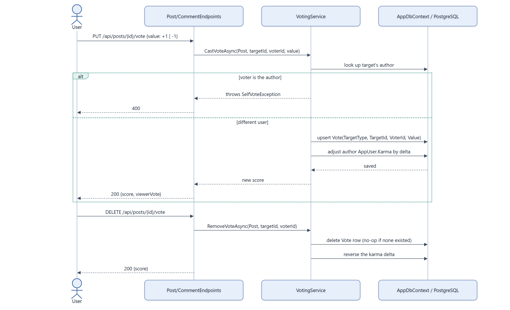

# Feature Flow — Voting & Reactions

Voting affects author karma and is exclusive per user/target; reactions are a separate,
karma-neutral mechanism with the same "one active value per user per target" shape. Both are
polymorphic over `Post`/`Comment` (see
[04-domain-model-core-content.md](04-domain-model-core-content.md)).

## Notes

- **Rate limited**: vote endpoints use the `Vote` rate-limit policy (both posts and comments).
- **Karma delta is applied in the same save as the vote** — switching a vote from −1 to +1 (via a
  second `PUT`) is an upsert that recomputes the delta, not two independent operations.
- **Reactions follow the identical shape but skip karma**: `PUT`/`DELETE
  /api/posts/{id}/reactions/{emoji}` (and the comment equivalent) go through `ReactionService`
  instead of `VotingService` — one active emoji per user per target, adding a *different* emoji
  replaces the prior one rather than stacking, and there is no karma side-effect. Summaries are
  grouped emoji counts plus whether the viewer reacted (`GetSummaryAsync`/`GetSummariesAsync`,
  batched for list views).
- Source: `backend/Services/VotingService.cs`, `backend/Services/ReactionService.cs`.
