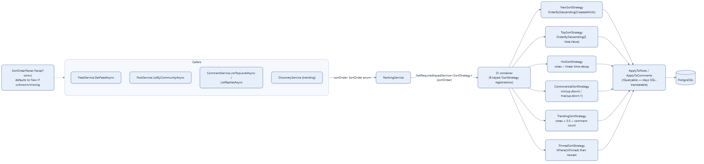

# Cross-Cutting Mechanism — Feed & Ranking (Strategy Pattern)

Sorting posts and comments is implemented as a textbook Strategy pattern, with .NET's keyed DI
container acting as the strategy factory — callers never reference a concrete strategy class.

## Notes

- **Registration**: `Program.cs` calls `AddKeyedScoped<ISortStrategy, X>(SortOrder.X)` once per
  strategy — `RankingService` resolves the right one at call time via
  `serviceProvider.GetRequiredKeyedService<ISortStrategy>(sortOrder)`. Adding a 7th sort order
  means adding one class + one registration line (Open/Closed) — `RankingService` itself never
  changes.
- **Hot and Controversial are intentionally simplified**: comments in the source note the linear
  time-decay (`hoursSinceCreated / 12`) is a placeholder for Reddit's logarithmic hot-ranking
  formula, and the controversial score drops log-volume weighting — both trade-offs exist so the
  scoring expression stays translatable to SQL via EF Core's `IQueryable`, rather than requiring
  results to be pulled into memory to compute.
- **Trending is engagement-weighted, not just votes** — it adds `0.5 × non-removed comment count`
  to the vote sum, distinguishing it from `Top`. The comment-side `TrendingSortStrategy` only uses
  vote sum (no analogous weighting exists for comments).
- **`PinnedSortStrategy` has no real meaning for comments** — pinning isn't a comment concept, so
  its `ApplyToComments` falls back to newest-first; nothing in the codebase actually calls it for
  comments today.
- **`DiscoveryService`** (trending endpoint) pre-filters by `TrendingWindow` (Day/Week) before
  handing off to `TrendingSortStrategy` to order.
- Source: `backend/Services/Ranking/*.cs`, `backend/Services/Ranking/Strategies/*.cs`.
