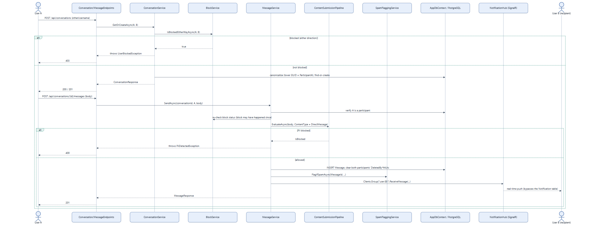

# Feature Flow — Direct Messaging

Starting a conversation and sending a message. Notably, direct messages **bypass** the
`Notification` table entirely and push straight through SignalR — contrast with
[11-comment-and-notification-flow.md](11-comment-and-notification-flow.md), which persists a
`Notification` row first.

## Notes

- **Block is checked twice**: once at conversation creation, again at every message send — a
  block can happen *after* a conversation already exists, and an existing conversation isn't
  auto-deleted when that happens.
- **Reply targets are validated**: `replyToMessageId` must belong to the same conversation, or
  `InvalidReplyTargetException` is thrown — prevents cross-conversation reply forgery.
- **New activity revives a hidden conversation**: sending clears both participants'
  `DeletedByAAtUtc`/`DeletedByBAtUtc`, so a conversation either side had deleted-for-self
  reappears in their list.
- **Rate limited**: `SendMessage` policy on `POST /api/conversations/{id}/messages`.
- **Reporting a DM**: `POST /api/messages/{id}/reports` feeds into the same moderation queue as
  post/comment reports — see [17-moderation-and-admin-flow.md](17-moderation-and-admin-flow.md).
- Source: `backend/Services/ConversationService.cs`, `backend/Services/MessageService.cs`,
  `backend/Services/BlockService.cs`.
