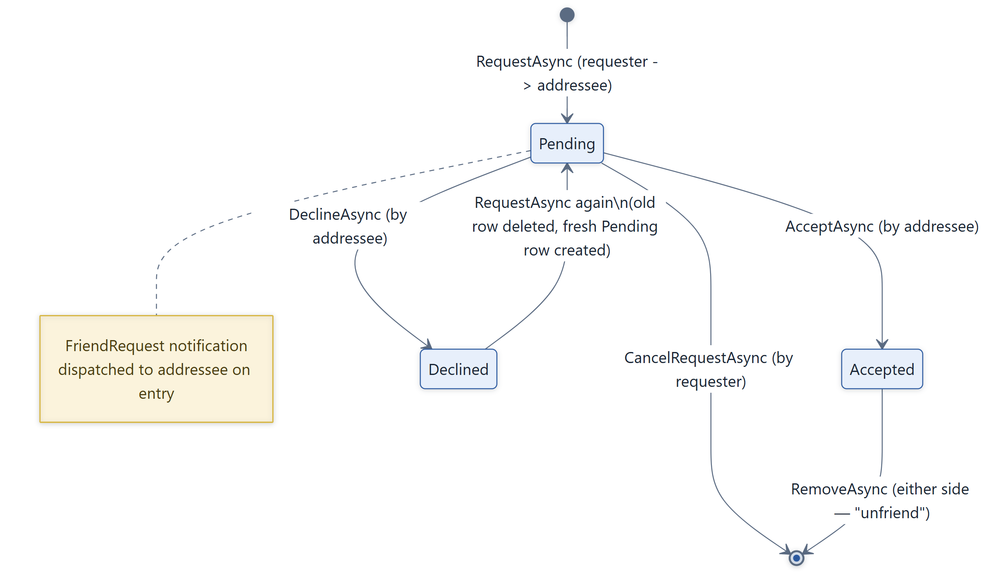
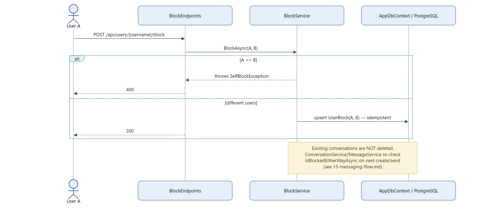

# Feature Flow — Friendship Lifecycle & Blocking

Friendship is a directional request/response state machine on a single row (no separate
"request" entity — `Friendship.Status` transitions in place). Blocking is a simpler idempotent
directional flag checked by other features rather than driving its own state machine.

## Friendship status lifecycle

## Blocking

## Notes

- **Only the addressee can accept/decline** — `GetPendingRequestAsync(requester, addressee)` is a
  directional lookup; the endpoint fetches the pending request using the *current* user as the
  addressee, so the requester calling accept/decline on their own outgoing request simply finds
  nothing.
- **An existing `Pending`/`Accepted` friendship blocks a new request** in either direction
  (`FriendshipAlreadyExistsException`) — but a `Declined` friendship is deleted and replaced with
  a fresh `Pending` row if the requester tries again, so a decline isn't permanent.
- **Self-friend-request and self-block are both explicitly rejected** (`SelfFriendRequestException`,
  `SelfBlockException`) rather than silently no-op'd.
- **Friend list visibility** (`AppUser.FriendListVisibility`: Everyone / FriendsOnly / NoOne) gates
  `GET /api/users/{username}/friends` independently of the friendship state machine above.
- Source: `backend/Services/FriendshipService.cs`, `backend/Services/BlockService.cs`.
