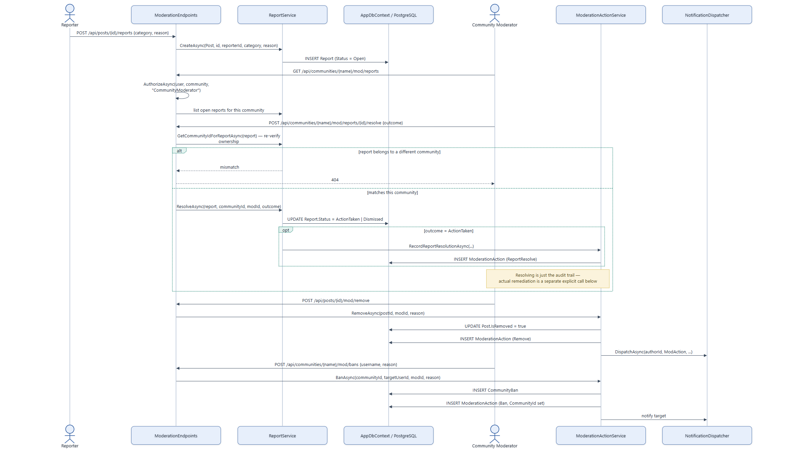
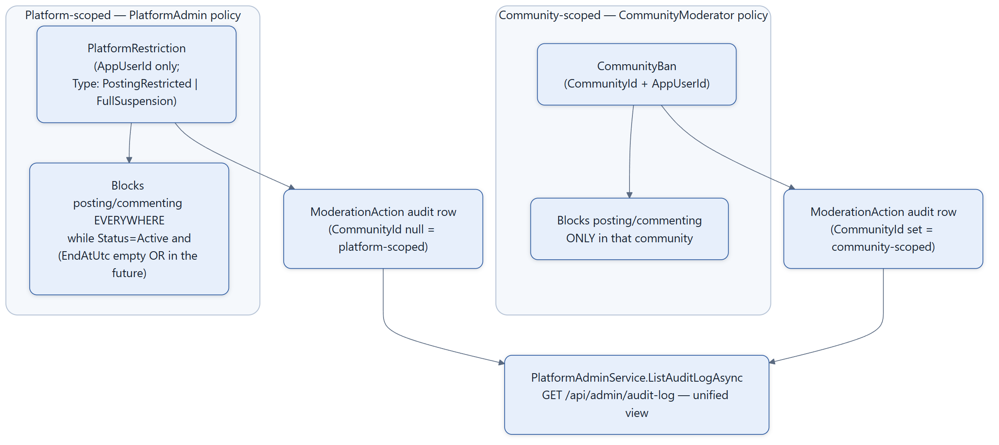

# Feature Flow — Moderation & Platform Admin

Two authorities operate on overlapping data: community moderators (`CommunityModerator` policy,
scoped to one community) and platform admins (`PlatformAdmin` policy, unscoped). Both write to the
same `ModerationAction` audit trail, discriminated by a nullable `CommunityId`.

## Report → resolution → remediation

## Community-scoped ban vs. platform-scoped restriction

## Notes

- **Every direct moderation action follows the same shape**: mutate entity state → write a
  `ModerationAction` row (audit trail) → dispatch a `ModAction` notification to the affected user
  (for Remove/Ban/Unban/Promote/Demote). Covers Pin/Unpin/Lock/Unlock/Remove on posts, Remove on
  comments, Ban/Unban, and Promote/Demote moderator.
- **Demoting the last moderator is blocked**: `SoleModeratorDemoteException` if the target is a
  community's only moderator (mirrors `SoleModeratorLeaveException` when a sole moderator tries to
  leave the community outright).
- **An expired `PlatformRestriction` is treated as inactive without needing an explicit admin
  action** — the check is `Status == Active && (EndAtUtc == null || EndAtUtc > now)`, evaluated
  identically in `PostService` and `CommentService`.
- **`GET /api/admin/reports`, `/spam-flags`, `/audit-log`** are platform-wide, unfiltered-by-community
  views over the *same* `Report`/`SpamFlag`/`ModerationAction` tables the community-scoped
  endpoints use — there's no separate platform-level report table.
- Source: `backend/Services/ReportService.cs`, `backend/Services/ModerationActionService.cs`,
  `backend/Services/PlatformAdminService.cs`, `backend/Endpoints/ModerationEndpoints.cs`,
  `backend/Endpoints/AdminEndpoints.cs`.
